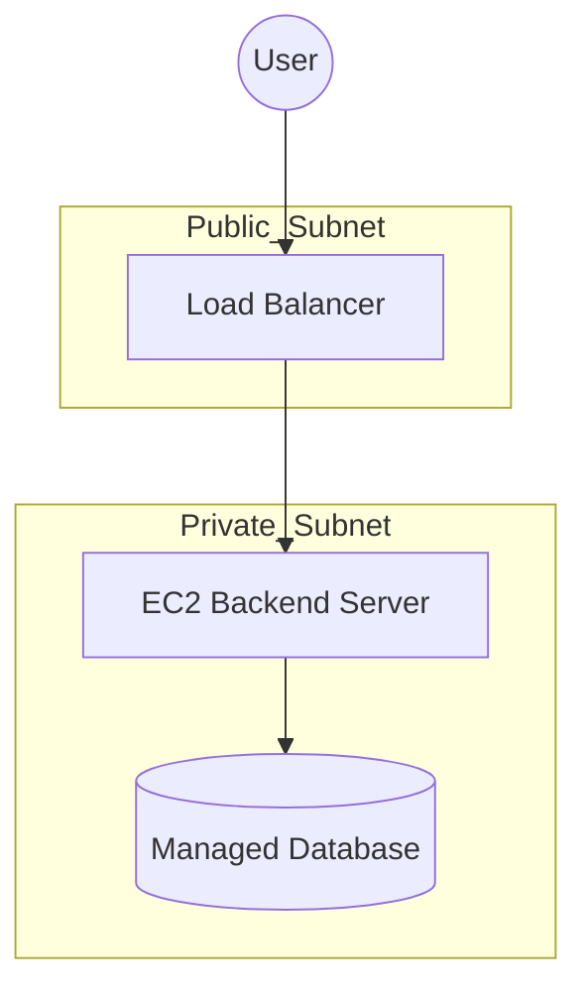

### AWAKE 7.0

#### Cloud-Native Excellence: 2-Tier Application (AWAKE 7.0 Capstone Project)

This project delivers a resilient, secure, cloud-native 2-tier application, built as the final Capstone for the AWAKE 7.0 Cloud Engineering Bootcamp.

### 📐 Architecture Diagram (Mermaid)



### 🚀 Project Summary

This system demonstrates core cloud-native engineering skills:

* Dockerized React frontend
* Dockerized Python backend API
* Decoupled 2-tier architecture
* Automated deployment with Terraform

### ☁️ Cloud infrastructure on AWS:

* Custom VPC
* Public + Private Subnets
* Internet Gateway & Route Tables
* Security Groups
* EC2 for backend
* S3 static hosting for frontend
* Load Balancer
* Secure and resilient design

---

## 📁 Project Structure

```
CapstoneProject/
├── frontend/
├── backend/
├── docker-compose.yml
└── terraform/
    ├── main.tf
    ├── provider.tf
    ├── variables.tf
    ├── outputs.tf
```

---

### 🐳 Run the Application Locally (Docker Compose)

**Start the full stack:**

```
docker compose up --build
```

**Stop:**

```
docker compose down
```

Frontend: [http://localhost:3000](http://localhost:3000)
Backend: [http://localhost:5000](http://localhost:8000)

---

## ☁️ Deploy the Infrastructure (Terraform)

**Initialize Terraform:**

```
cd terraform
terraform init
```

**Validate:**

```
terraform validate
```

**Plan:**

```
terraform plan
```

**Apply to AWS (after IAM credentials are ready):**

```
terraform apply
```

---

### 🔐 Security Highlight

* No plaintext credentials
* Backend runs in a private subnet
* Internet exposure limited to the Load Balancer
* S3 hosting is strictly for frontend static files
* IAM least-privilege (once applied)
* Network segmentation with layered security groups

---

## 🧪 Testing

**API Test:**

```
curl http://localhost:5000/
```

**UI Test:**
Visit:
[http://localhost:3000](http://localhost:3000)

---

---

## Project Reflections

### 1. What inspired your project?

Honestly, I wasn't excited about starting the project, but I knew I had to do it. The inspiration came from the challenge itself—I wanted to prove that I could take a big task and finish it, especially in the tech field. I chose to make the project to show I could build a secure, two-part system (frontend and backend with database) using everything I learned in the Cloud Engineering Bootcamp. It was about proving mastery over the tools.

---

### 2. What was the biggest challenge you faced?

My biggest challenge was **simply starting**. The project felt overwhelming, and I wasn't sure I could finish.
Technically, every part was challenging because I'm still a beginner. I spent a lot of time troubleshooting networking—making the servers and database communicate securely while keeping them isolated from the public internet.

---

### 3. What did I learn through this process?

I learned three key things:

1. **Just Start:** You must take the first step, even when you're unsure. Beginning the project made everything else possible.
2. **Use Modern Tools (AI):** Tools like AI made learning faster and debugging clearer. Without them, progress would've been much slower.
3. **Theory Becomes Real:** Concepts like private subnets, routing, Terraform automation, and security groups made more sense in real implementation. Practice makes theory stick.

---

## 👩‍💻 Author

**Phantom**
Cloud Engineering Track
AWAKE 7.0 — 2025 Capstone Project
